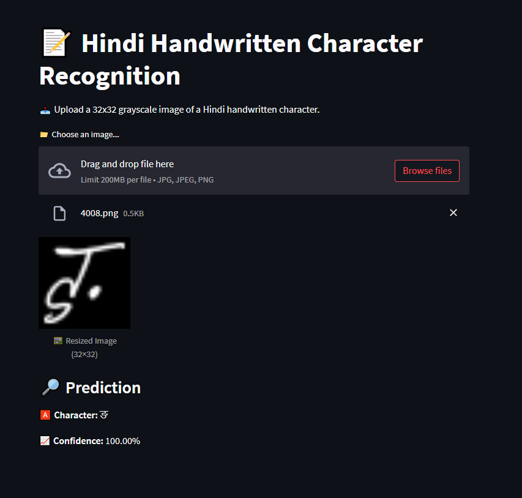

# 📝 Hindi Handwritten Character Recognition (CNN + Streamlit)

This project uses Convolutional Neural Networks (CNNs) to recognize Hindi handwritten characters. The application is deployed using **Streamlit** for real-time predictions.

## 🔍 Project Overview

- 📊 Dataset: 32x32 grayscale images of 10 Hindi (Devanagari) characters.
- 🔠 Classes: क, ख, ग, घ, ङ, च, छ, ज, झ, ञ
- 🧠 Models Used:
  - CNN (Convolutional Neural Network)
  - PCA + SVM
  - Random Forest Classifier
- 📉 Dimensionality Reduction: PCA & t-SNE
- 📈 Evaluation: Accuracy, Classification Report, Confusion Matrix

## 📂 Dataset

This project uses a subset of the Devanagari Character Dataset available on Kaggle:

🔗 [Devanagari Character Set – Kaggle](https://www.kaggle.com/datasets/rishianand/devanagari-character-set)

We selected the first 10 characters (क to ञ) and resized them to 32x32 grayscale images.

## 🧪 Model Training

- Data preprocessing: Label encoding, normalization
- Augmentation: Rotation, shift, zoom using `ImageDataGenerator`
- CNN architecture: Multiple Conv2D + BatchNorm + MaxPooling + Dropout layers
- Output: Softmax layer for multi-class classification

## 🖼️ t-SNE Visualization

The model includes 2D t-SNE visualizations to explore how classes are separated in lower-dimensional space.

## 🚀 Streamlit App

Interactive web app for live character prediction:
- Upload any 32×32 grayscale image
- The model predicts the corresponding Hindi character with confidence score

### 📸 Streamlit UI Preview



## 💾 Files

- `hindi_character_model.h5` — Trained CNN model
- `label_encoder.pkl` — Fitted LabelEncoder object
- `app.py` — Streamlit app code
- `Handwritten Letter Classification.ipynb` — Full model training and evaluation code

## 🛠️ Tech Stack

- Python, NumPy, Pandas
- Scikit-learn, TensorFlow / Keras
- Matplotlib, Seaborn
- Streamlit

## 📂 How to Run

To test the Streamlit app locally, a compressed file named `image.rar` is included in the repository.

1. Clone the repository
2. Install dependencies:
   ```bash
   pip install -r requirements.txt
   ```
3. Extract `image.rar` to get test images.
4. Run the Streamlit app:
   ```bash
   streamlit run app.py
   ```

---

## 📬 Contact

**Anil Kumar**  
MIS Executive | Aspiring Data Analyst | • Python • SQL • Power BI • Excel • Machine Learning  
📧 [ak26458624@gmail.com](mailto:ak26458624@gmail.com) | 
[LinkedIn](https://www.linkedin.com/in/anil-kumar-554561225/)
